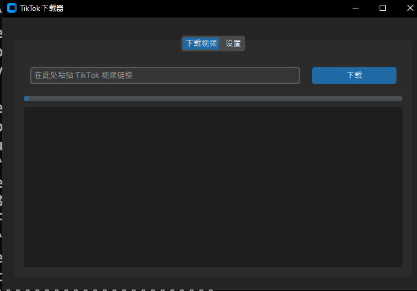

# Universal Media Downloader

[](https://www.python.org/downloads/)
[](https://flet.dev/)

A modern, beautiful, and cross-platform desktop application for downloading video and audio from hundreds of websites. Built with the powerful Flet UI framework and the legendary `yt-dlp` library.

## Preview



## ✨ Key Features

-   **Stunning Modern UI**: A fluid and stylish interface powered by Google's Flutter engine, thanks to Flet.
-   **Massive Site Support**: Downloads content from YouTube (videos, playlists), TikTok, Instagram, Twitter, Twitch, SoundCloud, and hundreds of other sites, all thanks to `yt-dlp`.
-   **Real-time Feedback**: A visual progress bar and a detailed log panel keep you informed.
-   **Easy to Use**: A clean, intuitive layout that just works.
-   **Custom Save Location**: Choose exactly where your files are saved.
-   **Multi-language Interface**: Switch between English, Russian (Русский), and Chinese (中文) on the fly.
-   **Truly Cross-Platform**: A single codebase that runs beautifully on Windows, macOS, and Linux.

## 🚀 Getting Started

Follow these instructions to get the application running on your local machine.

### Prerequisites

-   [Python 3.9](https://www.python.org/downloads/) or newer.
-   [pip](https://pip.pypa.io/en/stable/installation/) (Python's package installer).

### Installation

1.  **Clone the repository:**
    ```sh
    git clone https://github.com/FlexEbat/TKDR
    cd TKDR
    ```

2.  **Create and activate a virtual environment (highly recommended):**

    -   On Windows:
        ```sh
        python -m venv venv
        .\venv\Scripts\activate
        ```
    -   On macOS & Linux:
        ```sh
        python3 -m venv venv
        source venv/bin/activate
        ```

3.  **Install the required dependencies:**

    Create a file named `requirements.txt` in the project root with the following content:
    ```txt
    flet
    yt-dlp
    ```

    Then, run this command in your terminal:
    ```sh
    pip install -r requirements.txt
    ```

## 🎈 Usage

Once the installation is complete, launch the application with this simple command:

```sh
python TKDR.py
