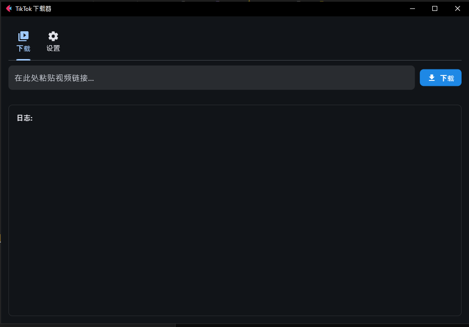

A modern and easy-to-use graphical interface for downloading TikTok videos without watermarks. Built with Python, CustomTkinter, and the powerful `yt-dlp` library.

## Preview

*(A screenshot of the application in action)*

 

## ✨ Features

-   **Modern & Clean UI**: A beautiful and intuitive interface built with [CustomTkinter](https://github.com/TomSchimansky/CustomTkinter).
-   **Easy Downloading**: Simply paste the video URL and click download.
-   **Real-time Progress Bar**: Keep track of your download status visually.
-   **Custom Save Location**: Choose exactly where you want to save your videos.
-   **Multi-language Support**: Switch between English, Russian (Русский), and Chinese (中文) on the fly.
-   **Cross-Platform**: Works on Windows, macOS, and Linux.

## 🚀 Getting Started

Follow these instructions to get a copy of the project up and running on your local machine.

### Prerequisites

-   [Python 3.9](https://www.python.org/downloads/) or newer.
-   [pip](https://pip.pypa.io/en/stable/installation/) (Python's package installer).

### Installation

1.  **Clone the repository:**
    ```sh
    git clone https://github.com/FlexEbat/TKDR
    cd tiktok-downloader-gui
    ```

2.  **Create and activate a virtual environment (recommended):**

    -   On Windows:
        ```sh
        python -m venv venv
        .\venv\Scripts\activate
        ```
    -   On macOS & Linux:
        ```sh
        python3 -m venv venv
        source venv/bin/activate
        ```

3.  **Install the required dependencies:**

    Create a file named `requirements.txt` in the project root with the following content:
    ```txt
    customtkinter
    yt-dlp
    ```

    Then, run the following command in your terminal:
    ```sh
    pip install -r requirements.txt
    ```

## 🎈 Usage

Once the installation is complete, you can run the application with a single command:

```sh
python TKDR.py
